# Step 1: Version Control with Git
# Fork the main repository into your GitHub account.

Forked the main repository using fork option in the github repo.

# Step 2: Prepare the MERN Application
### Containerize the Application
### Create Dockerfiles for each component (Frontend and Backend).
### Create individual ECR repositories.

This step ensures that the dockerfiles are created for each service so that images can be build and pushed to ECR in the next coming steps & also create different repositories for all the services

Created the dockerfile for all the services
Admin Service
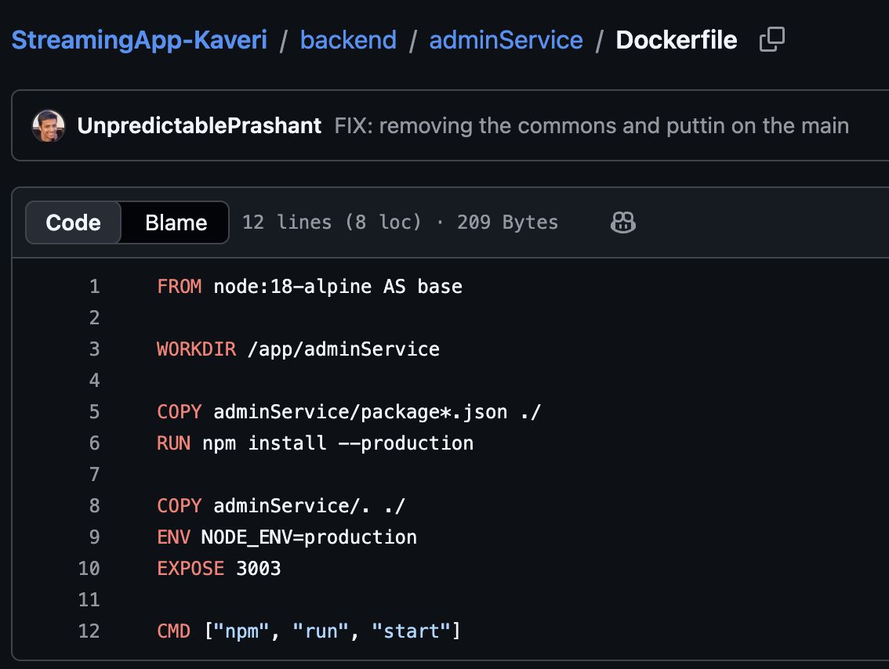

Auth Service
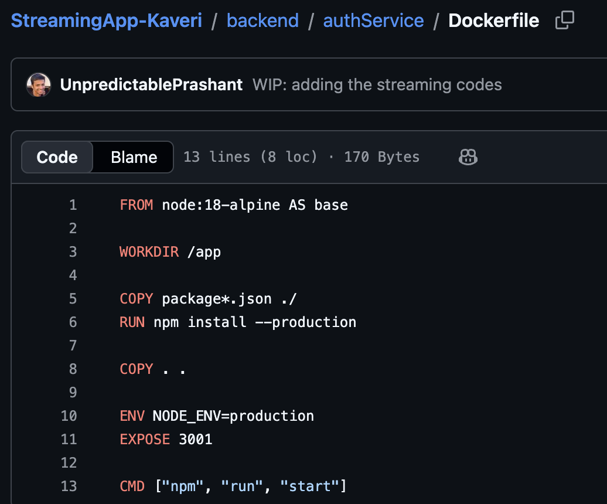

Chat Service
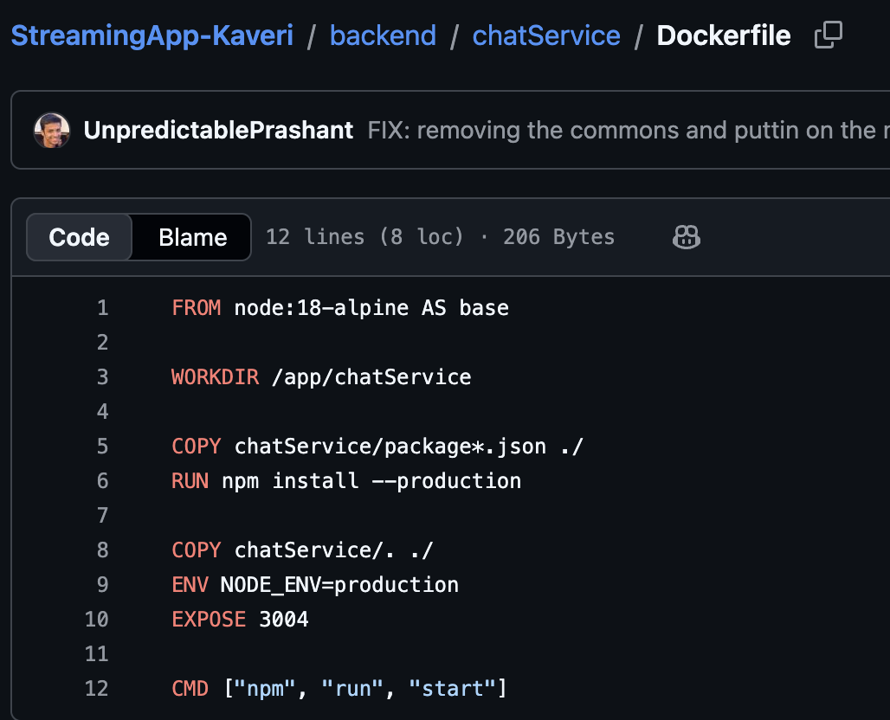

Streaming Service
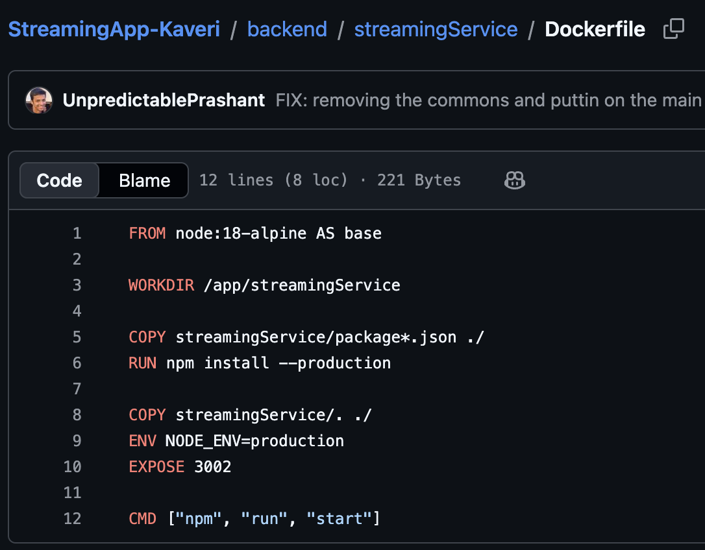

Frontend Service
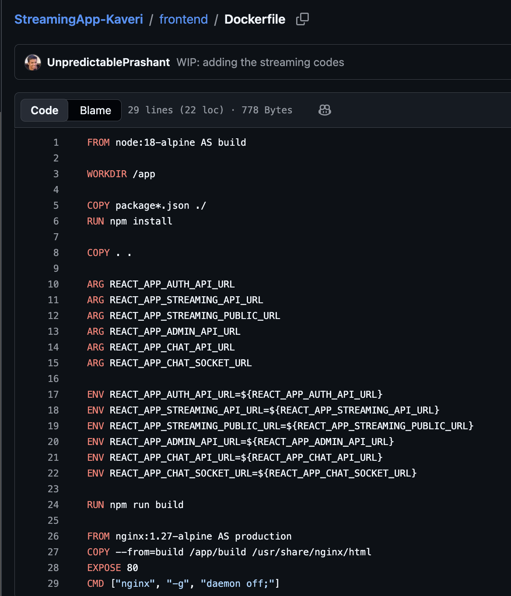

ECR Repositories created for each service
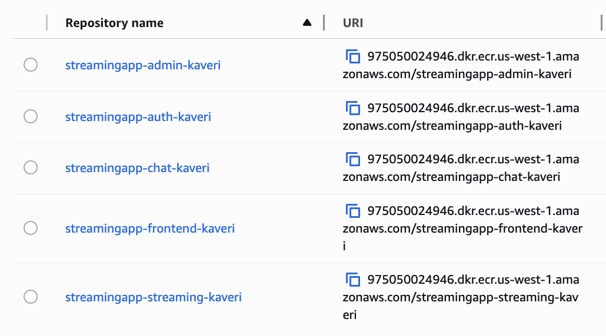

# Step 3: AWS Environment Setup (AWS CLI Installation & Configuration)

This step ensures that your local machine or CI/CD environment can securely interact with AWS services such as ECR, S3, and EKS using the AWS CLI.

brew install awscli
aws --version
aws configure

Enter the following:

AWS Access Key ID: <YOUR_ACCESS_KEY>
AWS Secret Access Key: <YOUR_SECRET_KEY>
Default region name: us-west-1
Default output format: json

# Step 4: Continuous Integration (CI) using Github Actions

This step ensures that pipeline is ready so that docker images are build and pushed to ECR repositories created in the Step 2. Pipeline gets triggered whenever there is any change in the app code.

Update the AWS ACCESS KEY ID and ACCESS KEY in the secrets in the Github Repo Settings
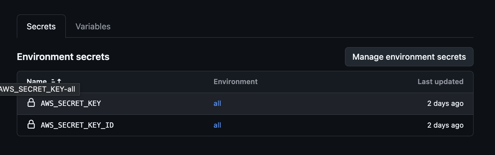

Start writing the pipeline.yaml
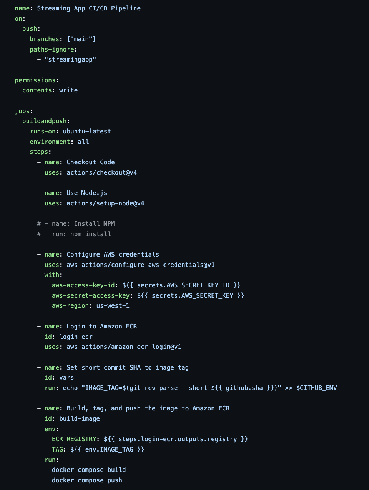
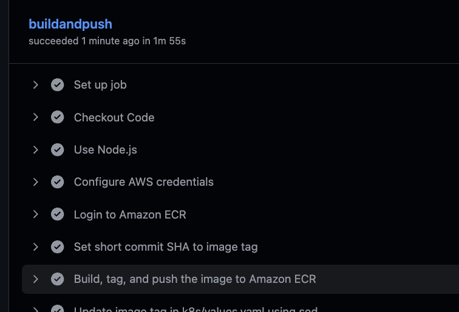

Images in ECR
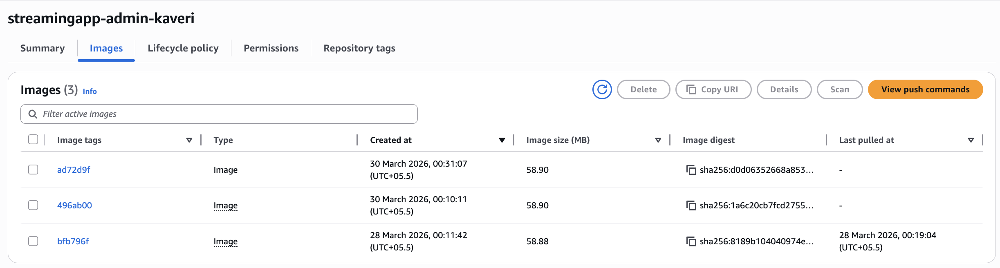
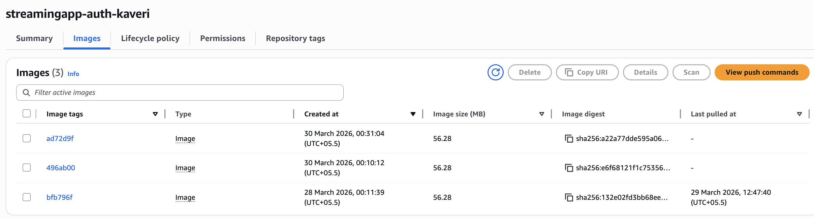
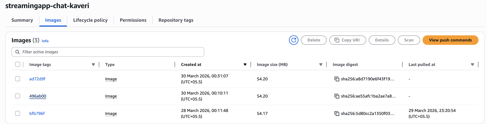
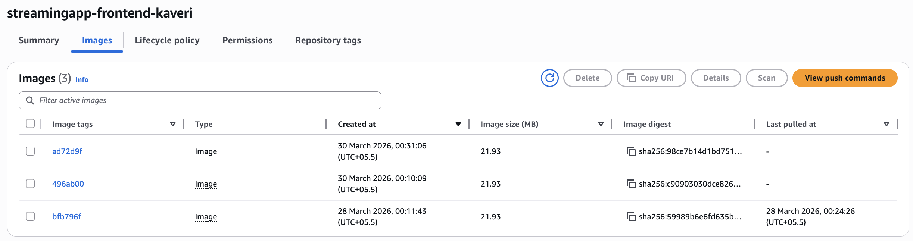
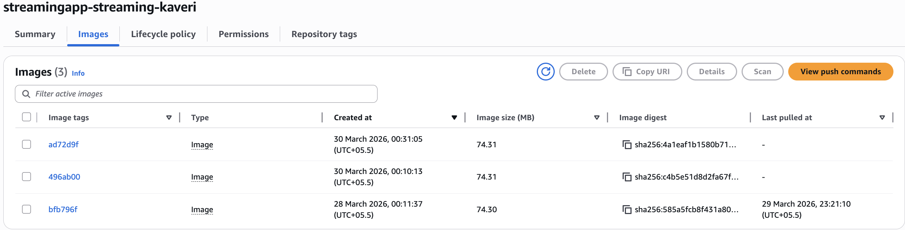

The next step in the CI CD pipeline is to update the latest image tag in the values.yaml file and then push it to the git repository. As the update on the values.yaml is on runner so it needs to be pushed to git.

Here the CI part ends.

