# Step 1: Version Control with Git
# Fork the main repository into your GitHub account.

Forked the main repository using fork option in the github repo.

# Step 2: Prepare the MERN Application
### Containerize the Application
### Create Dockerfiles for each component (Frontend and Backend).
### Create individual ECR repositories.

This step ensures that the dockerfiles are created for each service so that images can be build and pushed to ECR in the next coming steps & also create different repositories for all the services

Created the dockerfile for all the services
Admin Service

Auth Service

Chat Service

Streaming Service

Frontend Service

ECR Repositories created for each service

# Step 3: AWS Environment Setup (AWS CLI Installation & Configuration)

This step ensures that your local machine or CI/CD environment can securely interact with AWS services such as ECR, S3, and EKS using the AWS CLI.

brew install awscli
aws --version
aws configure

Enter the following:

AWS Access Key ID: <YOUR_ACCESS_KEY>
AWS Secret Access Key: <YOUR_SECRET_KEY>
Default region name: us-west-1
Default output format: json

# Step 4: Continuous Integration (CI) using Github Actions

This step ensures that pipeline is ready so that docker images are build and pushed to ECR repositories created in the Step 2. Pipeline gets triggered whenever there is any change in the app code.

Update the AWS ACCESS KEY ID and ACCESS KEY in the secrets in the Github Repo Settings

Start writing the pipeline.yaml

Images in ECR

The next step in the CI CD pipeline is to update the latest image tag in the values.yaml file and then push it to the git repository. As the update on the values.yaml is on runner so it needs to be pushed to git.

Here the CI part ends.

# Step 5: Kubernetes Deployment (EKS)

## Use "aws configure" to login to the AWS Account where EKS needs to be deployed.

### Now create the cluster using the below command (Make sure eksctl is installed)

eksctl create cluster --name <clustername> --region <cluster_region> --nodegroup-name <nodegroupname> --node-type <type_of_the_node(t3.medium)> --nodes <number_of_nodes> --managed --node-ami-family <Imagefornode>

### Create a namespace for helm using the command

kubectl create namespace helm

### Install ingress controller in the cluster

helm repo add ingress-nginx https://kubernetes.github.io/ingress-nginx
helm repo update

helm install ingress-nginx ingress-nginx/ingress-nginx \
  --namespace ingress-nginx \
  --create-namespace

### Create a Helm Chart for your app

For example, for streaming app I used below command
helm create streamingapp

Once you get the folder and the files, create the different manifest files in the templates folder.

Update the values in values.yaml file.

Update the App Name and version in Chart.yaml file.

Once the manifests files are ready, we can go ahead with deploying the application on the cluster using helm charts.

### Deploy the Application

helm package .
helm upgrade --install streamingapp ./streamingapp-1.11.0.tgz -n helm

Validate the resources created in the cluster whether all pods are running, service endpoints are there or not.

Now access the application using the LB URL(Get it from the ingress yaml file)
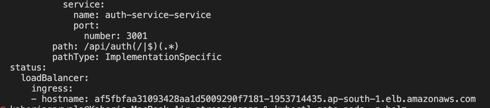

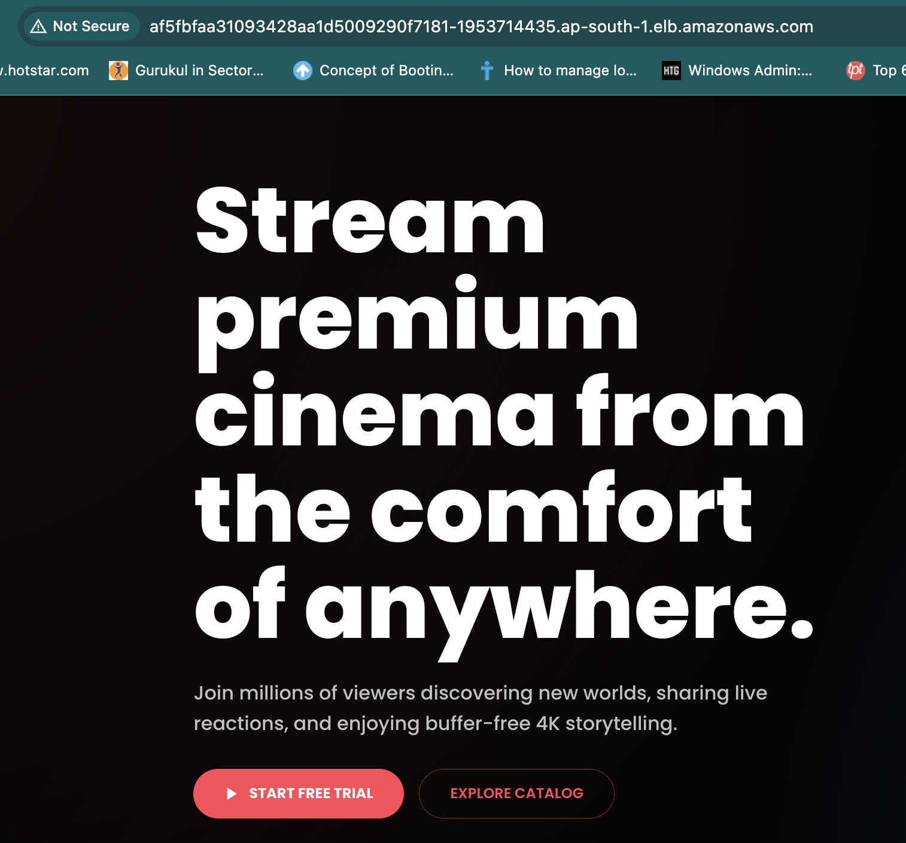

Click on Start Free Trial and Register
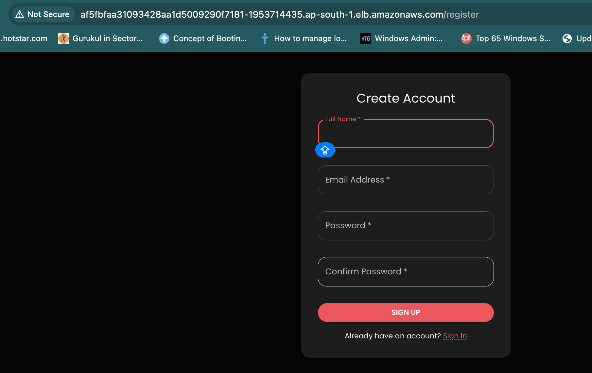

Once registered, you will get the below page.
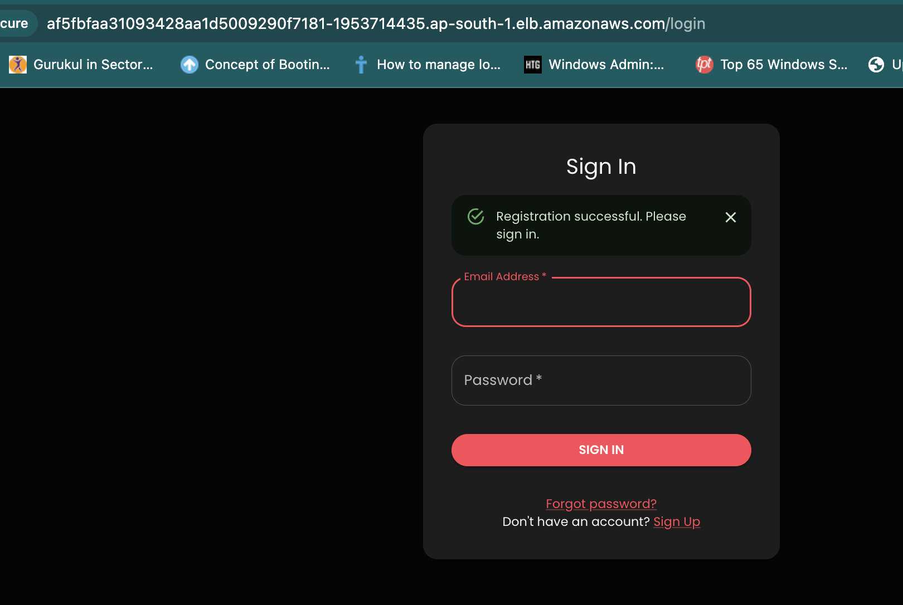

Now login using your credentials
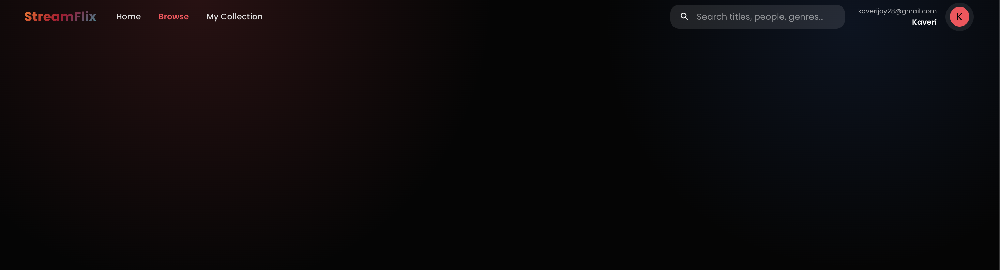

To login to the application as ADMIN, follow the below steps.
First, go to the database pod and change the role of the user you registered with as Admin.

kubectl exec -it <mongo-pod-name> -n helm -- sh

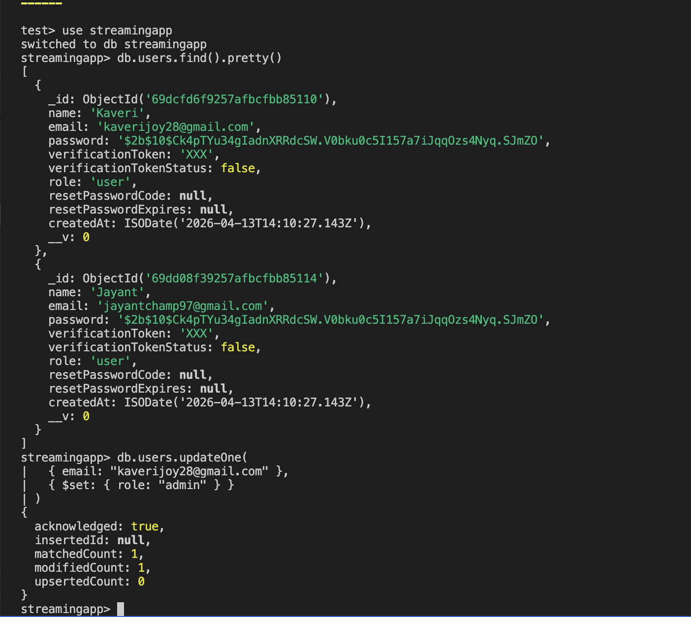

Now verify if the user is now an admin or not
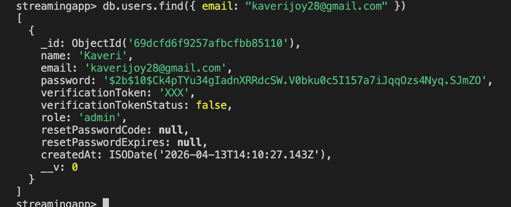

Login with the same user details now and you will be able to see Admin Studio there.
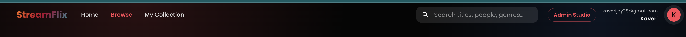

Click on the Admin Studio
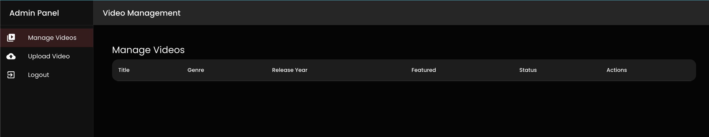

Upload a video
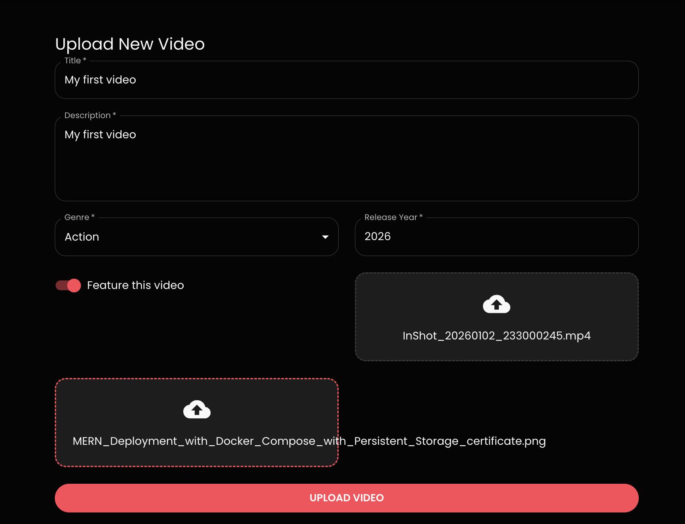

You will get this error and give proper access to the role mentioned in the error.
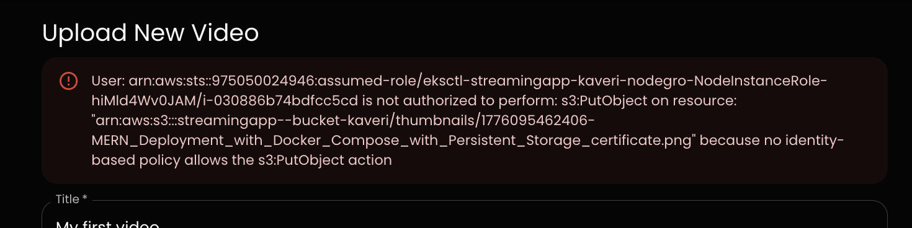

Provide the S3 related access and try uploading again.
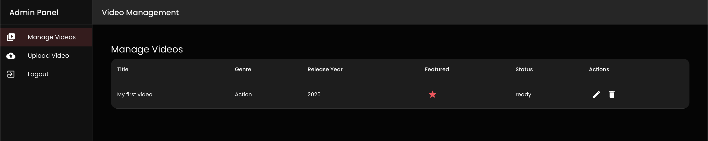

Go to the main page again and stream the video
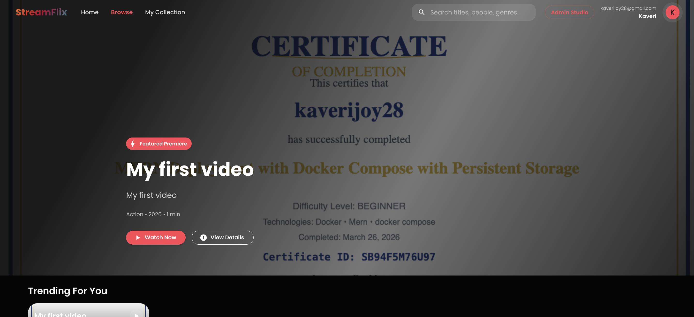

