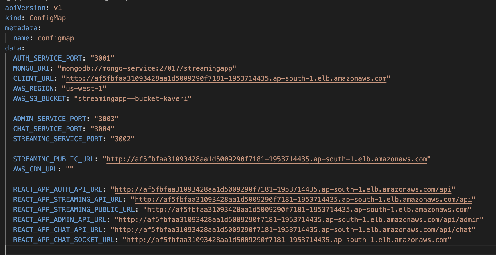

## Issue 1

I was getting CORS Issue as the right URL was not updated in the configmap.
Make sure the right URL is mentioned. (In case you are using ALB for ingress, mention the URL of the same accordingly)



## Issue 2

I was not getting the admin studio for a long time.
As when we register on the application, it registers us as an user and no user can have admin access unless role for that user is changed to admin.

I have included the steps in App Setup Readme file for setting up the same.

## Issue 3

The application was loading fine when trying to register and login but if we use the same link again or click back, it would not work and give us an error.

### SPA Routing Issue (React + Nginx)

### 🚨 Symptoms

* The application loaded correctly at:

  ```
  http://af5fbfaa31093428aa1d5009290f7181-1953714435.ap-south-1.elb.amazonaws.com/
  ```
* However:

  * Navigating directly to `http://af5fbfaa31093428aa1d5009290f7181-1953714435.ap-south-1.elb.amazonaws.com/admin`
  * Or refreshing the page on `/admin`

  resulted in:

  ```
  404 Not Found (Nginx)
  ```

---

### 🧠 Root Cause

This issue occurred because the frontend is built using **React (Single Page Application)**.

In an SPA:

* There is only **one real HTML file** → `index.html`
* Routes like `/admin`, `/browse`, `/login` are handled **client-side by React Router**
* These routes do **not exist as actual files or directories** on the server

---

### 💡 Simplified Explanation

Think of Nginx as a receptionist with a physical directory of rooms.

* When a request comes for `/admin`, Nginx tries to find:

  ```
  /usr/share/nginx/html/admin
  ```
* Since no such file or folder exists, it responds with:

  ```
  404 Not Found
  ```

But in reality:

* `/admin` is not a real file
* It is a **virtual route handled by React inside the browser**

---

### ⚠️ Why It Works on `/` but Fails on `/admin`

* When you open `/`, Nginx serves `index.html` → React loads → routing works ✅
* When you directly open `/admin`, Nginx tries to find a real file → fails ❌

---

### ✅ The Fix

We updated the Nginx configuration to include SPA fallback logic:

```nginx
location / {
    try_files $uri $uri/ /index.html;
}
```

---

### 🔧 Kubernetes Implementation

* Created a **ConfigMap** containing the custom `nginx.conf`
* Mounted it into the frontend container using a **volume mount**

Example:

```yaml
volumeMounts:
  - name: nginx-config
    mountPath: /etc/nginx/conf.d/default.conf
    subPath: default.conf
```

---

### 🪄 What This Fix Does

The directive:

```nginx
try_files $uri $uri/ /index.html;
```

tells Nginx:

> “If the requested path does not match a real file, serve `index.html` instead.”

So now:

| Request   | Behavior                                  |
| --------- | ----------------------------------------- |
| `/`       | Loads normally                            |
| `/admin`  | Serves `index.html` → React handles route |
| `/browse` | Serves `index.html` → React handles route |

---

### 🧩 Final Flow

```text
User → Nginx
        ├── If file exists → serve it
        └── Else → return index.html → React handles routing
```

---

### 📌 Key Takeaway

> When deploying React SPAs with Nginx, always configure a fallback to `index.html`.
> Otherwise, direct navigation or page refresh on nested routes will result in 404 errors.

---
